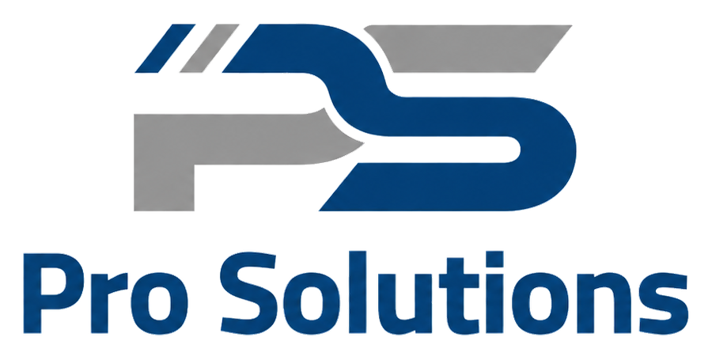

<!-- ===================== HEADER ===================== -->

<h1>
  
  &nbsp; Welcome to Pro Solutions
</h1>

  
  &nbsp;&nbsp;&nbsp;
  
  &nbsp;&nbsp;&nbsp;
  

<h3>
Odoo Partner | ERP Implementation | Business Automation | Accounting Consulting
</h3>

  

<!-- ===================== SMART NAVIGATION ===================== -->

  
  
  
  
  
  

---

<!-- ===================== ABOUT ===================== -->

## 🚀 About Pro Solutions

<table>
<tr>
<td width="100%" valign="top">

<h3 align="center">🌐 Turning Business Complexity into a Connected Odoo System</h3>

<strong>Pro Solutions</strong> helps businesses implement Odoo ERP, automate operations, 
and improve financial control through practical, scalable, and structured solutions.

We combine <strong>ERP implementation</strong>, <strong>business automation</strong>, <strong>accounting consulting</strong>, and <strong>digital transformation</strong> to move businesses from scattered manual work into one connected operational and financial environment.

</td>
</tr>
</table>

<table>
<tr>
<td width="33%" align="center" valign="top">

<h3>🔎 Business Clarity</h3>

We analyze workflows, pain points, and business needs before designing the Odoo structure.

</td>
<td width="33%" align="center" valign="top">

<h3>⚙️ Operational Control</h3>

We connect sales, purchases, inventory, accounting, approvals, and reporting in one cycle.

</td>
<td width="33%" align="center" valign="top">

<h3>📈 Scalable Growth</h3>

We build Odoo environments that are easy to use, easy to control, and ready to grow.

</td>
</tr>
</table>

  

---

<!-- ===================== WHAT WE DO ===================== -->

## 💼 What We Do

<table>
<tr>
<td width="33%" valign="top">

### 🧩 ERP Implementation

Structured Odoo implementation based on clear scope, business requirements, and best practices.

</td>
<td width="33%" valign="top">

### 📊 Accounting & Finance

Accounting setup, financial controls, cost centers, reports, and ERP-based finance processes.

</td>
<td width="33%" valign="top">

### ⚙️ Business Automation

Automation of workflows across sales, purchasing, inventory, accounting, and approvals.

</td>
</tr>

<tr>
<td width="33%" valign="top">

### 🧠 Process Analysis

Review current operations and identify gaps before system design and configuration.

</td>
<td width="33%" valign="top">

### 🎓 User Training

Practical user training focused on real business scenarios and daily operational use.

</td>
<td width="33%" valign="top">

### 🚀 Go-Live Support

Support during launch, transaction monitoring, issue handling, and system stabilization.

</td>
</tr>
</table>

  

---

<!-- ===================== IMPLEMENTATION ROADMAP ===================== -->

## 🧠 Our Implementation Roadmap

<table>
<tr>
<td width="33%" valign="top">

### 01. Discovery

Understand business requirements, pain points, current workflows, and project objectives.

</td>
<td width="33%" valign="top">

### 02. Solution Design

Define the Odoo structure, process flows, modules, roles, and configuration approach.

</td>
<td width="33%" valign="top">

### 03. Configuration

Configure modules, users, permissions, workflows, master data, and required settings.

</td>
</tr>

<tr>
<td width="33%" valign="top">

### 04. Data Migration

Prepare and import customers, vendors, products, opening balances, and operational data.

</td>
<td width="33%" valign="top">

### 05. Training & UAT

Train users, validate business cycles, collect feedback, and prepare for go-live.

</td>
<td width="33%" valign="top">

### 06. Go-Live Support

Support users during launch, monitor transactions, and stabilize the system.

</td>
</tr>

<tr>
<td width="33%" valign="top">

### 07. Optimization

Improve reports, controls, processes, and system usage after go-live.

</td>
<td width="33%" valign="top">

### Quality Review

Review access rights, accounting impact, workflows, and operational readiness.

</td>
<td width="33%" valign="top">

### Continuous Support

Provide post-go-live support, enhancements, and process improvement recommendations.

</td>
</tr>
</table>

  

---

<!-- ===================== ODOO MODULES ===================== -->

## 🧩 Odoo Modules We Work With

<table>
<tr>
<td align="center" width="25%">

### 🧾 Accounting

Journals, taxes, reports, payments, and financial controls.

</td>
<td align="center" width="25%">

### 🛒 Sales

Quotations, sales orders, pricing, invoicing, and customers.

</td>
<td align="center" width="25%">

### 🏷️ Purchase

RFQs, purchase orders, vendor bills, and suppliers.

</td>
<td align="center" width="25%">

### 📦 Inventory

Warehouses, stock moves, receipts, deliveries, and valuation.

</td>
</tr>

<tr>
<td align="center" width="25%">

### 🤝 CRM

Leads, opportunities, pipeline tracking, and sales activities.

</td>
<td align="center" width="25%">

### 🏭 Manufacturing

BOMs, work orders, production flows, and costing support.

</td>
<td align="center" width="25%">

### 📋 Project

Tasks, milestones, responsibilities, and project tracking.

</td>
<td align="center" width="25%">

### 💳 Expenses

Employee expenses, approvals, reimbursements, and accounting links.

</td>
</tr>

<tr>
<td align="center" width="25%">

### 👥 HR

Employees, attendance, leaves, contracts, and HR operations.

</td>
<td align="center" width="25%">

### 🧾 POS

Retail sales, sessions, payments, cashiers, and stock integration.

</td>
<td align="center" width="25%">

### ✅ Approvals

Approval workflows for expenses, purchases, and requests.

</td>
<td align="center" width="25%">

### 📁 Documents

Attachments, document control, approvals, and digital filing.

</td>
</tr>
</table>

  

---

<!-- ===================== INDUSTRIES ===================== -->

## 🎯 Industries We Serve

<table>
<tr>
<td align="center" width="25%">

### 🚚 Trading & Distribution

Inventory, sales, purchasing, customer balances, and supplier flow.

</td>
<td align="center" width="25%">

### 🏭 Manufacturing

Production, BOMs, work centers, costing, and inventory valuation.

</td>
<td align="center" width="25%">

### 🍽️ Food & FMCG

Fast-moving stock, distribution, sales operations, and reporting.

</td>
<td align="center" width="25%">

### 🏗️ Contracting

Project costing, procurement, expenses, accounting, and reporting.

</td>
</tr>

<tr>
<td align="center" width="25%">

### 🧑‍💼 Services

Projects, invoicing, customer management, and service delivery.

</td>
<td align="center" width="25%">

### 🛍️ Retail & POS

Branches, cashiers, POS sessions, inventory, and reports.

</td>
<td align="center" width="25%">

### 🌍 Localization & Translation

Multi-company, project tracking, vendor management, and costing.

</td>
<td align="center" width="25%">

### 💼 Professional Services

Consulting, timesheets, project billing, CRM, and management reporting.

</td>
</tr>
</table>

  

---

<!-- ===================== WHY PRO SOLUTIONS ===================== -->

## 🌟 Why Pro Solutions?

<table>
<tr>
<td width="50%" valign="top">

### ✅ Business-Oriented Delivery

We focus on business value, practical usage, and real operational results.

</td>
<td width="50%" valign="top">

### ✅ Strong Accounting Background

We understand accounting cycles, reporting, controls, cost centers, and finance requirements.

</td>
</tr>

<tr>
<td width="50%" valign="top">

### ✅ Clear Scope & Documentation

We deliver clear scope, plans, assumptions, responsibilities, and project documentation.

</td>
<td width="50%" valign="top">

### ✅ Training & Support

We provide practical training, go-live support, and continuous improvement after implementation.

</td>
</tr>
</table>

  

---

<!-- ===================== GITHUB ACTIVITY ===================== -->

## 📊 GitHub Activity

  

---

<!-- ===================== CONTACT ===================== -->

## 🤝 Let's Connect

<h2>Business Inquiry Hub</h2>

Looking to implement Odoo, automate your business, improve financial control, or optimize your ERP operations?

<strong>Connect with Pro Solutions through the channels below.</strong>

 

<table>
<tr>
<td align="center" width="25%">

### 📧 Email

 

info@prosolutionseg.com

</td>

<td align="center" width="25%">

### 🌐 Website

 

prosolutionseg.com

</td>

<td align="center" width="25%">

### 💼 LinkedIn

 

Pro Finance Consulting

</td>

<td align="center" width="25%">

### 📱 WhatsApp

 

+20 102 1888 448

</td>
</tr>
</table>

 

  
  
  
  

  

---

<!-- ===================== FOOTER ===================== -->

### Building smarter businesses with Odoo 🚀

