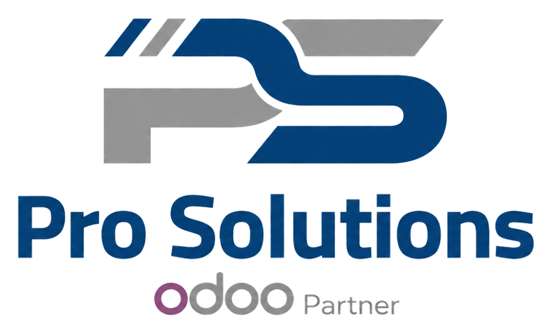

<h1>👋 Welcome to Pro Solutions</h1>

  
  &nbsp;&nbsp;&nbsp;&nbsp;
  

<h3>
Odoo Partner | ERP Implementation | Business Automation | Consulting
</h3>

  

---

## 🚀 About Pro Solutions

**Pro Solutions** is an Odoo Partner specialized in **ERP Implementation, Business Automation, Accounting Consulting, and Digital Transformation**.

We help businesses move from manual processes, scattered Excel sheets, and disconnected workflows into a fully integrated ERP environment using **Odoo**.

---

## 💼 What We Do

<table>
<tr>
<td width="33%" valign="top">

### 🧩 ERP Implementation

We implement Odoo based on real business needs, clear scope, and structured delivery.

</td>
<td width="33%" valign="top">

### 📊 Accounting & Finance

We support companies with accounting setup, financial control, reporting, and ERP-based finance processes.

</td>
<td width="33%" valign="top">

### ⚙️ Business Automation

We automate workflows across sales, purchasing, inventory, accounting, operations, and approvals.

</td>
</tr>
</table>

---

## 🧠 Our Implementation Roadmap

<table>
<tr>
<td width="33%" valign="top">

### 🔍 01. Discovery

Understand business requirements, pain points, current workflows, and project objectives.

</td>
<td width="33%" valign="top">

### 🏗️ 02. Solution Design

Define the best-fit Odoo structure, process flows, modules, roles, and configuration approach.

</td>
<td width="33%" valign="top">

### ⚙️ 03. Configuration

Configure Odoo modules, users, permissions, workflows, master data, and required settings.

</td>
</tr>

<tr>
<td width="33%" valign="top">

### 📦 04. Data Migration

Prepare and import customers, vendors, products, opening balances, and operational data.

</td>
<td width="33%" valign="top">

### 🎓 05. Training & UAT

Train key users, validate business cycles, and collect feedback before go-live.

</td>
<td width="33%" valign="top">

### 🚀 06. Go-Live Support

Support users during launch, monitor transactions, and stabilize the system.

</td>
</tr>

<tr>
<td width="33%" valign="top">

### 📈 07. Optimization

Improve reports, controls, processes, and system usage after go-live.

</td>
<td width="33%" valign="top">

### 🛡️ Quality Control

Review configuration, access rights, accounting impact, and operational readiness.

</td>
<td width="33%" valign="top">

### 🤝 Continuous Support

Provide post-go-live assistance, reporting improvements, and process enhancement.

</td>
</tr>
</table>

---

## 🧩 Odoo Modules We Work With

<table>
<tr>
<td align="center" width="25%">

### 🧾  
**Accounting**

Financial entries, taxes, journals, reports, and controls.

</td>
<td align="center" width="25%">

### 🛒  
**Sales**

Quotations, sales orders, pricing, invoicing, and customer flow.

</td>
<td align="center" width="25%">

### 🏷️  
**Purchase**

RFQs, purchase orders, vendor bills, and supplier management.

</td>
<td align="center" width="25%">

### 📦  
**Inventory**

Warehouses, stock moves, receipts, deliveries, and valuation.

</td>
</tr>

<tr>
<td align="center" width="25%">

### 🤝  
**CRM**

Leads, opportunities, pipeline tracking, and sales activities.

</td>
<td align="center" width="25%">

### 🏭  
**Manufacturing**

BOMs, work orders, production flows, and costing support.

</td>
<td align="center" width="25%">

### 📋  
**Project**

Tasks, milestones, team assignments, and project tracking.

</td>
<td align="center" width="25%">

### 💳  
**Expenses**

Employee expenses, approvals, reimbursements, and accounting links.

</td>
</tr>

<tr>
<td align="center" width="25%">

### 👥  
**HR**

Employees, attendance, leaves, contracts, and HR operations.

</td>
<td align="center" width="25%">

### 🧾  
**POS**

Retail sales, cashier flow, sessions, payments, and stock integration.

</td>
<td align="center" width="25%">

### ✅  
**Approvals**

Approval workflows for purchases, expenses, requests, and controls.

</td>
<td align="center" width="25%">

### 📁  
**Documents**

Document management, attachments, approvals, and digital filing.

</td>
</tr>
</table>

---

## 🎯 Industries We Serve

<table>
<tr>
<td align="center" width="25%">

### 🚚  
**Trading & Distribution**

Sales, purchasing, inventory, customer balances, and supplier flow.

</td>
<td align="center" width="25%">

### 🏭  
**Manufacturing**

Production, costing, BOMs, work centers, and inventory valuation.

</td>
<td align="center" width="25%">

### 🍽️  
**Food & FMCG**

Fast-moving products, stock control, sales operations, and distribution.

</td>
<td align="center" width="25%">

### 🏗️  
**Contracting**

Project costing, expenses, accounting, procurement, and reporting.

</td>
</tr>

<tr>
<td align="center" width="25%">

### 🧑‍💼  
**Services**

Service delivery, invoicing, projects, tasks, and customer management.

</td>
<td align="center" width="25%">

### 🛍️  
**Retail & POS**

POS operations, branches, cashier control, inventory, and reporting.

</td>
<td align="center" width="25%">

### 🌍  
**Localization & Translation**

Multi-company, project tracking, vendor management, and service costing.

</td>
<td align="center" width="25%">

### 💼  
**Professional Services**

Consulting, timesheets, project billing, CRM, and management reporting.

</td>
</tr>
</table>

---

## 🌟 Why Pro Solutions?

<table>
<tr>
<td width="50%" valign="top">

### ✅ Business-Oriented Delivery

We focus on business value, not only system configuration.  
Our goal is to make Odoo practical, usable, and aligned with daily operations.

</td>
<td width="50%" valign="top">

### ✅ Strong Accounting Background

We understand financial control, reporting, accounting cycles, cost centers, and management requirements.

</td>
</tr>
<tr>
<td width="50%" valign="top">

### ✅ Clear Scope & Documentation

We deliver structured scope, implementation plan, responsibilities, assumptions, and project documentation.

</td>
<td width="50%" valign="top">

### ✅ Training & Support

We provide user training, go-live support, and continuous improvement after implementation.

</td>
</tr>
</table>

---

## 📊 GitHub Activity

---

## 🤝 Let's Connect

<h2>Business Inquiry Hub</h2>

Looking to implement Odoo, automate your business, improve financial control, or optimize your ERP operations?

<strong>Start the conversation with Pro Solutions.</strong>

 

 
 

<table>
<tr>
<td align="center" width="25%">

### 📧 Email

 

Info@prosolutionseg.com

</td>
<td align="center" width="25%">

### 🌐 Website

 

prosolutionseg.com

</td>
<td align="center" width="25%">

### 💼 LinkedIn

 

Pro Finance Consulting

</td>
<td align="center" width="25%">

### 📱 WhatsApp

 

+20 102 1888 448

</td>
</tr>
</table>

 

  
  
  
  

---

### Building smarter businesses with Odoo 🚀

